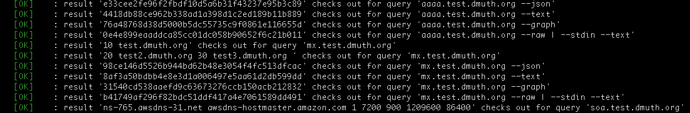

# DNS Tool

This is a DNS tool I wrote, based off [example code I found here](https://routley.io/tech/2017/12/28/hand-writing-dns-messages.html).
It creates DNS packets from scratch and sends the queries to a DNS server.

It is a work in progress, and will be updated.


## Features

- Output in text, JSON, and pretty-printed JSON
- Debugging support with Python's builtin logger app
- Sanity Checking module which reports on any inconsistencies it finds in the response.


## Requirements

- Python 3
- A desire to learn more about how the Internet works


## Usage

```
usage: dns-tool [-h] [--query-type QUERY_TYPE] [--request-id REQUEST_ID]
                   [--json] [--json-pretty-print] [--text] [--graph] [--raw]
                   [--stdin] [--fake-ttl] [--debug] [--quiet]
                   [query] [server]

Make DNS queries and tear apart the result packets

positional arguments:
  query                 String to query for (e.g. "google.com")
  server                DNS server (default: 8.8.8.8)

optional arguments:
  -h, --help            show this help message and exit
  --query-type QUERY_TYPE
                        Query type (Supported types: A, AAAA, CNAME, MX, SOA,
                        NS) Defalt: a
  --request-id REQUEST_ID
                        Hex value for a request ID (default: random)
  --json                Output response as JSON
  --json-pretty-print   Output response as JSON Pretty-printed
  --text                Output response as formatted text
  --graph               Output response as ASCII graph of DNS response packet
  --raw                 Output raw DNS packet and immediately exit
  --stdin               Instead of making DNS query, read packet from stdin.
                        (works great with --raw!)
  --fake-ttl            Set a fake TTL, for use in test scripts where hashes
                        are made of the output
  --debug, -d           Enable debugging
  --quiet, -q           Quiet mode--only log errors
```


## Sample Run

### Text output

Let's run a query for google.com:

```
$ ./dns-tool google.com --text 
Question
========
   Question: google.com (len: 16)
   Type:     1 (A (Address))
   Class:    1 (IN)
   Server:   8.8.8.8:53

Header
======
   Request ID:         1aab
   Questions:          1
   Answers:            1
   Authority records:  0
   Additional records: 0
   QR:      Response
   AA:      Server isn't an authority
   TC:      Message not truncated
   RD:      Recursion requested
   RA:      Recursion available!
   OPCODE:  0 - Standard query
   RCODE:   0 - No errors reported

Answers
=======
   Answer #0:   172.217.7.238
   CLASS:       1 (IN)
   TYPE:        1 (A (Address))
   TTL:         154
   Raw RRDATA:  c0 0c 00 01 00 01 00 00 00 9a 00 04 ac d9 07 ee (len 4)
   Full RRDATA: {'ip': '172.217.7.238'}
```


### Graphs of DNS packets

Want to see DNS packets graphed?  Watch this!
```
./dns-tool --query-type mx gmail.com --graph

Question
========

                                1  1  1  1  1  1
     0  1  2  3  4  5  6  7  8  9  0  1  2  3  4  5
   +--+--+--+--+--+--+--+--+--+--+--+--+--+--+--+------------+
   |  QNAME: gmail.com                                       |
   |    len:  5 value: gmail                                 |
   |    len:  3 value: com                                   |
   |    len:  0 value: (nil)                                 |
   +--+--+--+--+--+--+--+--+--+--+--+--+--+--+--+------------+
   |  QTYPE:   15 - MX (Mail Exchange)                       |
   +--+--+--+--+--+--+--+--+--+--+--+--+--+--+--+------------+
   | QCLASS:   1 - IN                                        |
   +--+--+--+--+--+--+--+--+--+--+--+--+--+--+--+------------+

Header
======

                                1  1  1  1  1  1
     0  1  2  3  4  5  6  7  8  9  0  1  2  3  4  5
   +--+--+--+--+--+--+--+--+--+--+--+--+--+--+--+--+
   |             Request ID: 91dd                  |
   +--+--+--+--+--+--+--+--+--+--+--+--+--+--+--+--+
   |QR| Opcode: 0 |  |  |RD|RA|  Z: 0  | RCODE: 0  |
   +--+--+--+--+--+--+--+--+--+--+--+--+--+--+--+--+
   |          Question Count: 1                    |
   +--+--+--+--+--+--+--+--+--+--+--+--+--+--+--+--+
   |          Answer Count: 5                      |
   +--+--+--+--+--+--+--+--+--+--+--+--+--+--+--+--+
   |          Authority/Nameserver Count: 0        |
   +--+--+--+--+--+--+--+--+--+--+--+--+--+--+--+--+
   |          Additional Records Count: 0          |
   +--+--+--+--+--+--+--+--+--+--+--+--+--+--+--+--+

Answers
=======

                                1  1  1  1  1  1
     0  1  2  3  4  5  6  7  8  9  0  1  2  3  4  5
   +--+--+--+--+--+--+--+--+--+--+--+--+--+--+--+------------+
   |  NAME     : gmail.com                                   |
   |    pointer:  12 target: gmail                           |
   |        len:   0  value: (nil)                           |
   +--+--+--+--+--+--+--+--+--+--+--+--+--+--+--+------------+
   |  TYPE:   15 - MX (Mail Exchange)                        |
   +--+--+--+--+--+--+--+--+--+--+--+--+--+--+--+------------+
   | CLASS:   1 - IN                                         |
   +--+--+--+--+--+--+--+--+--+--+--+--+--+--+--+------------+
   |   TTL:       3599 - 59 minutes from now                 |
   +--+--+--+--+--+--+--+--+--+--+--+--+--+--+--+------------+
   |   RDLENGTH:  32                                         |
   +--+--+--+--+--+--+--+--+--+--+--+--+--+--+--+------------+
   |     RDDATA: 20 alt2.gmail-smtp-in.l.google.com          |
   |        len:   4  value: alt2                            |
   |        len:  13  value: gmail-smtp-in                   |
   |        len:   1  value: l                               |
   |        len:   6  value: google                          |
   |    pointer:  18 target: com                             |
   |        len:   0  value: (nil)                           |
   +--+--+--+--+--+--+--+--+--+--+--+--+--+--+--+------------+

                                1  1  1  1  1  1
     0  1  2  3  4  5  6  7  8  9  0  1  2  3  4  5
   +--+--+--+--+--+--+--+--+--+--+--+--+--+--+--+------------+
   |  NAME     : gmail.com                                   |
   |    pointer:  12 target: gmail                           |
   |        len:   0  value: (nil)                           |
   +--+--+--+--+--+--+--+--+--+--+--+--+--+--+--+------------+
   |  TYPE:   15 - MX (Mail Exchange)                        |
   +--+--+--+--+--+--+--+--+--+--+--+--+--+--+--+------------+
   | CLASS:   1 - IN                                         |
   +--+--+--+--+--+--+--+--+--+--+--+--+--+--+--+------------+
   |   TTL:       3599 - 59 minutes from now                 |
   +--+--+--+--+--+--+--+--+--+--+--+--+--+--+--+------------+
   |   RDLENGTH:   9                                         |
   +--+--+--+--+--+--+--+--+--+--+--+--+--+--+--+------------+
   |     RDDATA: 40 alt4.gmail-smtp-in.l.google.com          |
   |        len:   4  value: alt4                            |
   |    pointer:  46 target: gmail-smtp-in                   |
   |    pointer:  18 target: com                             |
   |        len:   0  value: (nil)                           |
   +--+--+--+--+--+--+--+--+--+--+--+--+--+--+--+------------+

                                1  1  1  1  1  1
     0  1  2  3  4  5  6  7  8  9  0  1  2  3  4  5
   +--+--+--+--+--+--+--+--+--+--+--+--+--+--+--+------------+
   |  NAME     : gmail.com                                   |
   |    pointer:  12 target: gmail                           |
   |        len:   0  value: (nil)                           |
   +--+--+--+--+--+--+--+--+--+--+--+--+--+--+--+------------+
   |  TYPE:   15 - MX (Mail Exchange)                        |
   +--+--+--+--+--+--+--+--+--+--+--+--+--+--+--+------------+
   | CLASS:   1 - IN                                         |
   +--+--+--+--+--+--+--+--+--+--+--+--+--+--+--+------------+
   |   TTL:       3599 - 59 minutes from now                 |
   +--+--+--+--+--+--+--+--+--+--+--+--+--+--+--+------------+
   |   RDLENGTH:   4                                         |
   +--+--+--+--+--+--+--+--+--+--+--+--+--+--+--+------------+
   |     RDDATA: 5 gmail-smtp-in.l.google.com                |
   |    pointer:  46 target: gmail-smtp-in                   |
   |    pointer:  18 target: com                             |
   |        len:   0  value: (nil)                           |
   +--+--+--+--+--+--+--+--+--+--+--+--+--+--+--+------------+
[snip]
```


## Sanity Checking

This app also supports sanity checking on responses it gets from DNS servers.
If something is off (usage of a reserved field, etc.), the app will let you know.
Here is sample output from a run with `--text`:

```
Answer
======
   Answer:     172.217.15.110
   QCLASS:     123 (IN)
   QTYPE:      123 (A (Address))
   TTL:        216
   Raw RRDATA: acd90f6e (len 4)

Sanity Checks Failed
====================
   Content of Z field in header is not zero: 2
   Request ID on answer (aaaa) != request ID of question (beef)!
   OPCODE > 2 reserved for future use! (Qtype = 14)
   Invalid RCODE (77)
   QCLASS in answer is < 1 (0)
```


## DNS Message Format


### High-level Overview

This comes right from <a href="https://tools.ietf.org/html/rfc1035">RFC 1035</a>, section 4.1:

```
    +---------------------+
    |        Header       |
    +---------------------+
    |       Question      | the question for the name server
    +---------------------+
    |        Answer       | Resource Records (RRs) answering the question
    +---------------------+
    |      Authority      | RRs pointing toward an authority
    +---------------------+
    |      Additional     | RRs holding additional information
    +---------------------+
```

When the message is first sent out, it looks like this:
```
    +---------------------+
    |        Header       |
    +---------------------+
    |       Question      |
    +---------------------+
```

The server then tweaks bits in the header accordingly and appends zero or more answers.
There are a couple of neat thigs about this approach:

- 512 bytes is well under the smallest <a href="https://en.wikipedia.org/wiki/Page_(computer_memory)">memory page size</a> of modern CPUs
- The DNS server can malloc() 512 bytes for every request that comes in, which means that...
- The message can be modified in place--the header flags can be tweaked and answers can be appended onto the end of the question.

This might seem like a case of premature optimization, but a busy DNS resolver might handle thousands of requests
per second, at which point all of the extra clock cycles that are saved really add up.

That said, the 512 byte limit is a concern, which leads us to...


### Message Compression and Pointers

Normally, the domain name(s) in an answer are in the format of a byte indicating length, followed
by that many bytes, followed by either another length byte, a zero (indicating the end of that domain name),
or a pointer.  To visualize that, here's how `www.google.com` would look:

`0x03 www 0x06 google 0x03 com 0x00`

Everybody got that?  Good.  Now let's talk about how pointers might fit in.  If you made a
query for say, nameservers on `google.com` that returned `ns1.google.com` and `ns2.google.com`, 
you'd get an answer like this:

```
0x03 ns1 0x06   google 0x03 com 0x00
0x03 ns2 0xC020
```

Breaking that down, a pointer is two bytes, where the first two bits of the first byte are both
set to one, which is decimal 192 or hex 0xC0.  So in this case, `0x20` is 32 decimal, which is the offset
for the `0x06 google` in the first answer above.


#### "So the maximum length of a label in a domain name is only 63 characters?"

Yep.  Only the last 6 bits are used.


#### "Let's go deeper"

That example I gave above wasn't quite right.  You see, a pointer points to the offset
from the start of the *message*.  So there is no reason why a pointer as to point to the *answer*
section but could instead point to the *question*!

Here is a truer representation of what the above answer might look like

```
0x03 ns1 0xC00C
0x03 ns2 0xC00C
```

In both cases, the answer is a length byte, "ns1" or "ns2", and a pointer to "google.com" back in the question
part of that message.  Yes, you can even have *pointers to pointers*.  So if you had, for example, two additional
answers of "europe.ns1.google.com" and "dk.europe.ns1.google.com", the answer might look like this:

```
0x03 ns1 0xCO0C
0x03 ns2 0xC00C
0x06 europe 0xC018
0x02 dk 0xC031
```

And just to show my work on how those offsets were calculated:

```
Header        : 12 bytes
Question      : len=6 + "google" + len=3 + "com" + 0x00 (12 bytes)  + 2 bytes QTYPE + 2 bytes QCLASS = 16 bytes
Answer ns1    : len=3 + "ns1" + pointer=0xC00C + 2 bytes TYPE + 2 bytes CLASS + 4 bytes TTL + 2 bytes RDLENGTH = 16 bytes
Answer ns2    : len=3 + "ns2" + pointer=0xC00C = 5 bytes
Answer europe : len=6 + "europe" + pointer=0xC01C = 9 bytes
Answer dk     : len=2 + "dk" + pointer=0xC031
```


#### "This is madness"

Again, this seems like a bit of over-engineering, but in the context of trying to fit as much data as humanly
possible into a 512 byte message, this is very efficient.

Keep in mind that the RFC for DNS was written back in *1987* -- 31 years ago as of this writing!  The
creators of that document were smart enough to realize that DNS would eventually become a part of the 
Internet's infrastructure, but they weren't sure how complex the answers might be, and needed to future-proof
their procotol as best they could.


## Module Architecture

- `create.py`: Functions for creating the DNS request
- `output.py`: Functions for printing out the answer to a DNS query
- `parse.py`: Functions to parse the the header
- `parse_answer.py`: Functions to parse the answer headers
- `parse_answer_body.py`: Parse the Resource Records (RR)
- `parse_question.py`: Parse the question
- `sanity.py`: Functions to perform sanity checks on answer


## Testing

There is a wrapper script called `test.sh` which can be used to test against records
in the zone `test.dmuth.org`.  I have a series of test DNS records set up there that are
guaranteed to return speific results.

Running that script will produce a bunch of output like this:



Those are hashes of the output compared to what we should have gotten.


### Why not use PyTest?

Good question!  The reason I gravitated more towards this method is because I have
some pretty complicated argument parsing, and I want to test different combinations
of those parameters and make sure that I get the right result, hence the reason for
testing full runs of the script and comparing the outputs.


## TODO List

Things I may do at some point, depending on time, timing, and other projects:

- Put this entire app into a Pip package (can I fetch with Git?)
- Handle RDNS queries/responses
- Unit testing for parsing functions
- Docker container to run a custom DNS server
- Docker containers to run different DNS servers and verify behavior across different DNS server software


## Further Reading

- https://routley.io/tech/2017/12/28/hand-writing-dns-messages.html
- http://www.tcpipguide.com/free/t_DNSMessageHeaderandQuestionSectionFormat.htm
- https://tools.ietf.org/html/rfc1035


## Development

At the moment, this is written in Python 2.7, so you'll need to install Virtualenv to point 
to your copy of Python 2.7:

```
virtualenv --python=$(which python2.7) virtualenv
. ./virtualenv/bin/activate
pip install -r ./requirements.txt
```


## Credits

- Icon made by <a href="https://www.flaticon.com/authors/gregor-cresnar" title="Gregor Cresnar">Gregor Cresnar</a> from <a href="https://www.flaticon.com/" title="Flaticon">www.flaticon.com</a> is licensed by <a href="http://creativecommons.org/licenses/by/3.0/" title="Creative Commons BY 3.0" target="_blank">CC 3.0 BY</a>.


## Contact

If you see anything wrong, or anything you'd like add, feel free to open an issue.
You can also find me on [Twitter](http://twitter.com/dmuth) and [Facebook](http://www.facebook.com/dmuth).


